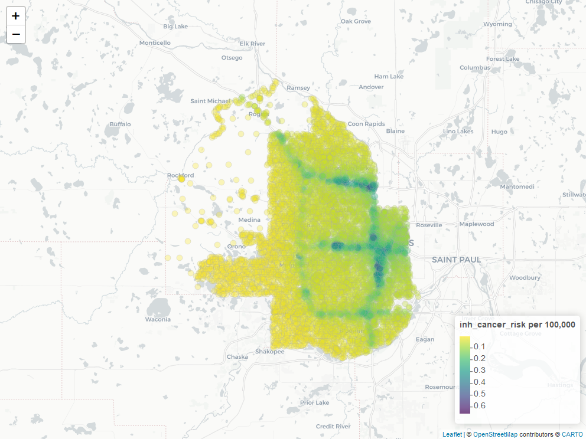
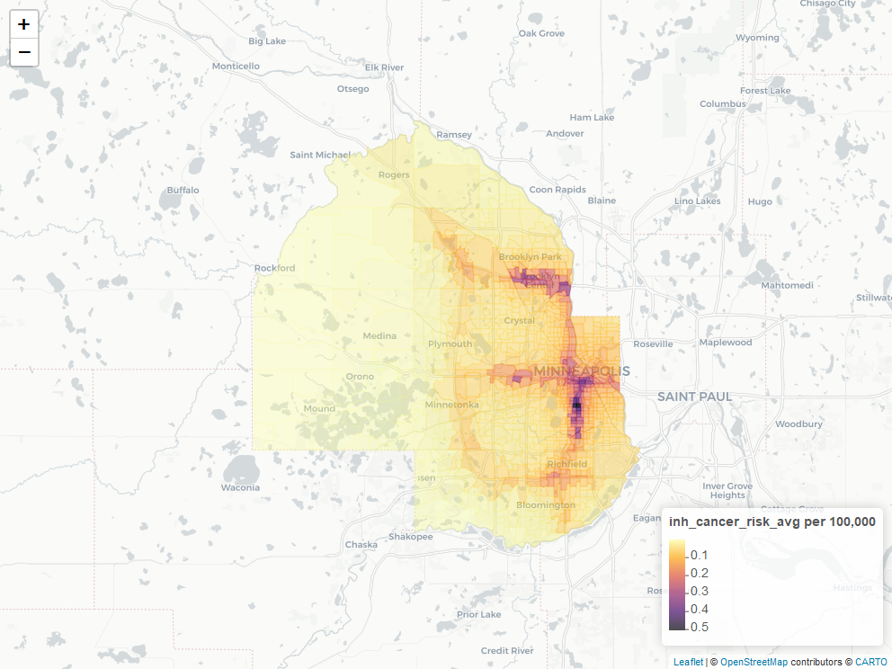

Helper functions and results from MNRISKS - Minnesota's air modeling results of the statewide emission inventory.  


1. Install
2. Load model inputs
3. Read model results
4. Block group spatial averages
5. Find closed facilities
6. Map receptors and block groups
7. Add data to package


## 1. Install
```{r, eval = F}
install.packages("remotes")
remotes::install_github("dkvale/mnrisks")
```


## 2. Load model inputs
```{r, message = F}
library(mnrisks)
library(dplyr)
```


<br>
__Load all modeling receptors__  
```{r}
all_receptors <- get_receptors()
```

```{r, echo=F}
library(knitr)

kable(head(all_receptors))
```


<br>
__Load a single block group's receptors__  
```{r}
points <- get_receptors(bg_id = c(270530269101))

plot(points$lat, points$long, pch = 16)

```

```{r, echo = F}
kable(head(points))
```


<br>
__Block group Census 2010 population data__  
```{r}
bg_census <- get_census(year = 2010)
```

```{r, echo=F}
kable(head(bg_census))
```


## 3. Read model results

> Read MNRISKS .rsk file output

__Use `filter_word` to only return rows containing a given word__
```{r, eval = F}
boilers <- read_rsk("area_results.rsk", year = 2017, filter_word = "Boilers")
```


## 4. Calculate Block group spatial averages using the area coverage of each receptor

__View the block group areas for each receptor__
```{r}
rec_areas <- get_receptor_bg_areas()

```

```{r, echo = F}
kable(head(rec_areas))
```


The `spatial_bg_avg` function calculates the spatial block group averages by joining the area fractions above 
to MNRISKS receptor results.

```{r}
df <- get(data(onroad_inhalation_risk_2011))

# For a single pollutant
benzene <- filter(df, `COPC Name` == "Benzene")

bg_avg <- benzene %>% 
          spatial_bg_avg(result_cols   = c("Inhalation Cancer Risk", "Inhalation Hazard Index"),
                         receptor_col  = "Receptor",
                         pollutant_col = "COPC Name",
                         year          = 2011)
```

```{r, echo = F}
kable(head(arrange(bg_avg, -`Inhalation Cancer Risk_avg`)))
```

<br>
```{r, results='hide'}
# For multiple pollutants
multi <- filter(df, `COPC Name` %in% c("Benzene", "Acrolein", "Lead", "Cobalt"))

bg_avg <- multi %>% 
          spatial_bg_avg(result_cols   = c("Inhalation Cancer Risk", "Inhalation Hazard Index"), 
                         receptor_col  = "Receptor",
                         pollutant_col = "COPC Name",
                         year = 2011)
```

```{r, echo = F}
kable(head(arrange(dplyr::filter(bg_avg, pollutant != "PM2.5 Diesel"), -`Inhalation Cancer Risk_avg`)))
```


<br>

## 5. Find closed facilities

The `find_closed_facilities` function returns a table with CEDR Source IDs and Agency IDs of facilities with terminated air permits from between the calendar year 2013 and the entered year. The default year is 2022. This function uses RODBC and so must be run in 32BIT R.

```{r, eval = F}
# For the default year
closed_facilities <- get_closed_facilities()

# For a future year
closed_facilities <- get_closed_facilities(year = 2044)

```

<br>

## 6. Maps
__Receptor map__
```{r, eval = F}
data(hennepin_onroad_inhalation_risk_2017)

# Receptor cancer risks from onroad sources in Hennepin county
map_receptors(hennepin_onroad_inhalation_risk_2017 %>% sample_n(7200),
              result_col   = "inh_cancer_risk",
              receptor_col = "receptor",
              colors       = "viridis")

```

```{r, echo = F, warning = F}
data(hennepin_onroad_inhalation_risk_2017)

# Receptor cancer risks from onroad sources in Hennepin county
m <- map_receptors(hennepin_onroad_inhalation_risk_2017 %>% sample_n(7200),
              result_col   = "inh_cancer_risk",
              receptor_col = "receptor",
              colors       = "viridis",
              silent = TRUE)

## save html to png
htmlwidgets::saveWidget(m, "leaflet_map.html", selfcontained = FALSE)

webshot::webshot("leaflet_map.html", file = "leaflet_map.png",
                 cliprect = "viewport")

## optionally display image when using knitr
#
```

__Block group average map__
```{r, eval = F}
# Average block group cancer risks from onroad sources in Hennepin county
bg_avg <- hennepin_onroad_inhalation_risk_2017 %>% 
          spatial_bg_avg(result_cols = c("inh_cancer_risk", "inh_hazard_risk"), 
                         year = 2017)
# Leaflet map
map_bgs(bg_avg,
        result_col = "inh_cancer_risk_avg",
        colors     = "inferno")
```

```{r, echo = F, eval = T, warning = F}
bg_avg <- hennepin_onroad_inhalation_risk_2017 %>% 
          spatial_bg_avg(result_cols = c("inh_cancer_risk", "inh_hazard_risk"), 
                         year = 2017)
# Leaflet map
m <- map_bgs(bg_avg,
        result_col = "inh_cancer_risk_avg",
        colors     = "inferno",
        silent = T)

## save html to png
htmlwidgets::saveWidget(m, "leaflet_map2.html", selfcontained = FALSE)

webshot::webshot("leaflet_map2.html", file = "leaflet_map2.png",
                 cliprect = "viewport")

## optionally display image when using knitr
#
```


## 7. Add data
```{r, eval = F}
new_data

usethis::use_data(new_data)

devtools::document()
```
