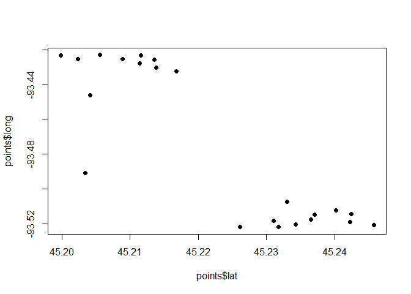

mnrisks
================

Helper functions and results from MNRISKS - Minnesota’s air modeling of
the statewide emission inventory.

1.  Install
2.  Load model inputs
3.  Read model results
4.  Block group spatial averages
5.  Find closed facilities
6.  Map receptors and block groups
7.  Add data to package

## 1. Install

``` r
install.packages("remotes")
remotes::install_github("mpca-air/mnrisks")
```

## 2. Load model inputs

``` r
library(mnrisks)
library(dplyr)
```

<br> **Load all modeling receptors**

``` r
all_receptors <- get_receptors()
```

| lakes_rec_id | mpca_rec_id | county | mpca_bg_geoid | mpca_x\_utm | mpca_y\_utm |      long |      lat |
|-------------:|------------:|:-------|--------------:|------------:|------------:|----------:|---------:|
|            1 |           1 | Canada |       9.9e+11 |      356982 |     5473519 | -94.97113 | 49.39755 |
|            2 |           2 | Canada |       9.9e+11 |      359799 |     5472979 | -94.93214 | 49.39335 |
|            3 |           3 | Canada |       9.9e+11 |      348033 |     5473265 | -95.09428 | 49.39310 |
|            4 |           4 | Canada |       9.9e+11 |      345878 |     5473259 | -95.12396 | 49.39250 |
|            5 |           5 | Canada |       9.9e+11 |      342510 |     5473117 | -95.17028 | 49.39036 |
|            6 |           6 | Canada |       9.9e+11 |      355346 |     5470752 | -94.99265 | 49.37229 |

<br> **Load a single block group’s receptors**

``` r
points <- get_receptors(bg_id = c(270530269101))

plot(points$lat, points$long, pch = 16)
```

<!-- -->

| lakes_rec_id | mpca_rec_id | county   | mpca_bg_geoid | mpca_x\_utm | mpca_y\_utm |      long |      lat |
|-------------:|------------:|:---------|--------------:|------------:|------------:|----------:|---------:|
|        32425 |       32425 | Hennepin |  270530269101 |      459142 |     5010378 | -93.52063 | 45.24571 |
|        32533 |       32533 | Hennepin |  270530269101 |      459632 |     5010014 | -93.51436 | 45.24246 |
|        32547 |       32547 | Hennepin |  270530269101 |      459283 |     5009994 | -93.51880 | 45.24226 |
|        32602 |       32602 | Hennepin |  270530269101 |      459813 |     5009756 | -93.51203 | 45.24015 |
|        32703 |       32703 | Hennepin |  270530269101 |      459610 |     5009412 | -93.51459 | 45.23704 |
|        32748 |       32748 | Hennepin |  270530269101 |      459391 |     5009351 | -93.51738 | 45.23648 |

<br> **Block group Census 2010 population data**

``` r
bg_census <- get_census(year = 2010)
```

|        geoid |      area | metro | county          | county_fips | population | population_moe | income_median | income_median_moe | pct_below_185pct_poverty | status_tribal_nation | status_poc | status_185x_poverty |
|-------------:|----------:|------:|:----------------|------------:|-----------:|---------------:|--------------:|------------------:|-------------------------:|:---------------------|:-----------|:--------------------|
| 271739701001 |  13913100 |     0 | YELLOW MEDICINE |       27173 |        680 |            153 |         70625 |             29412 |                    29.41 | FALSE                | FALSE      | FALSE               |
| 271739701002 |    513000 |     0 | YELLOW MEDICINE |       27173 |        570 |            114 |         48214 |             18919 |                    22.37 | FALSE                | FALSE      | FALSE               |
| 271739701003 |   4736700 |     0 | YELLOW MEDICINE |       27173 |        781 |            172 |         41786 |              8800 |                    34.44 | FALSE                | FALSE      | FALSE               |
| 271739701004 | 187942000 |     0 | YELLOW MEDICINE |       27173 |        534 |            101 |         70000 |              9490 |                    10.86 | FALSE                | FALSE      | FALSE               |
| 271739701005 | 176791000 |     0 | YELLOW MEDICINE |       27173 |        535 |             67 |         68077 |              5450 |                    18.68 | TRUE                 | FALSE      | FALSE               |
| 271739702001 |   3450600 |     0 | YELLOW MEDICINE |       27173 |        801 |            138 |         48750 |              8863 |                    22.97 | FALSE                | FALSE      | FALSE               |

## 3. Read model results

> Read MNRISKS .rsk file output

**Use `filter_word` to only return rows containing a given word**

``` r
boilers <- read_rsk("area_results.rsk", year = 2017, filter_word = "Boilers")
```

## 4. Calculate Block group spatial averages using the area coverage of each receptor

**View the block group areas for each receptor**

``` r
rec_areas <- get_receptor_bg_areas()
```

| geoid        | receptor |   area_wt |
|:-------------|---------:|----------:|
| 270531260001 |    52508 | 0.0117515 |
| 270531260001 |    52381 | 0.3542159 |
| 270531260001 |    52225 | 0.0058149 |
| 270531260001 |    52524 | 0.0395259 |
| 270531260001 |    52279 | 0.1053743 |
| 270531260001 |    52306 | 0.2695935 |

The `spatial_bg_avg` function calculates the spatial block group
averages by joining the area fractions above to MNRISKS receptor
results.

``` r
df <- get(data(onroad_inhalation_risk_2011))

# For a single pollutant
benzene <- filter(df, `COPC Name` == "Benzene")

bg_avg <- benzene %>% 
          spatial_bg_avg(result_cols   = c("Inhalation Cancer Risk", "Inhalation Hazard Index"),
                         receptor_col  = "Receptor",
                         pollutant_col = "COPC Name",
                         year          = 2011)
```

    ## Joining, by = "receptor"

    ## [1] "Calculating average [Inhalation Cancer Risk]"
    ## [1] "Benzene"
    ## [1] "Calculating average [Inhalation Hazard Index]"
    ## [1] "Benzene"

| geoid        | pollutant | Inhalation Hazard Index_avg | Inhalation Cancer Risk_avg |
|:-------------|:----------|----------------------------:|---------------------------:|
| 270531054001 | Benzene   |                    0.046000 |                    4.6e-06 |
| 270531054002 | Benzene   |                    0.007880 |                    8.0e-07 |
| 270531044002 | Benzene   |                    0.001450 |                    1.0e-07 |
| 270530059012 | Benzene   |                    0.000881 |                    1.0e-07 |
| 270531261001 | Benzene   |                    0.000452 |                    0.0e+00 |
| 270530001011 | Benzene   |                    0.000000 |                    0.0e+00 |

<br>

``` r
# For multiple pollutants
multi <- filter(df, `COPC Name` %in% c("Benzene", "Acrolein", "Lead", "Cobalt"))

bg_avg <- multi %>% 
          spatial_bg_avg(result_cols   = c("Inhalation Cancer Risk", "Inhalation Hazard Index"), 
                         receptor_col  = "Receptor",
                         pollutant_col = "COPC Name",
                         year = 2011)
```

    ## Joining, by = "receptor"

| geoid        | pollutant | Inhalation Hazard Index_avg | Inhalation Cancer Risk_avg |
|:-------------|:----------|----------------------------:|---------------------------:|
| 270531054001 | Benzene   |                    0.046000 |                    4.6e-06 |
| 270531054002 | Benzene   |                    0.007880 |                    8.0e-07 |
| 270531054001 | Cobalt    |                    0.024100 |                    6.0e-07 |
| 270531044002 | Benzene   |                    0.001450 |                    1.0e-07 |
| 270531054002 | Cobalt    |                    0.004100 |                    1.0e-07 |
| 270530059012 | Benzene   |                    0.000881 |                    1.0e-07 |

<br>

## 5. Find closed facilities

The `find_closed_facilities` function returns a table with CEDR Source
IDs and Agency IDs of facilities with terminated air permits from
between the calendar year 2013 and the entered year. The default year is
2022.

``` r
# For the default year
closed_facilities <- get_closed_facilities()

# For a future year
closed_facilities <- get_closed_facilities(year = 2023)
```

<br>

## 6. Maps

**Receptor map**

``` r
data(hennepin_onroad_inhalation_risk_2017)

# Receptor cancer risks from onroad sources in Hennepin county
map_receptors(hennepin_onroad_inhalation_risk_2017 %>% sample_n(7200),
              result_col   = "inh_cancer_risk",
              receptor_col = "receptor",
              colors       = "viridis")
```

    ## Assuming "long" and "lat" are longitude and latitude, respectively

    ## PhantomJS not found. You can install it with webshot::install_phantomjs(). If it is installed, please make sure the phantomjs executable can be found via the PATH variable.

    ## NULL

**Block group average map**

``` r
# Average block group cancer risks from onroad sources in Hennepin county
bg_avg <- hennepin_onroad_inhalation_risk_2017 %>% 
          spatial_bg_avg(result_cols = c("inh_cancer_risk", "inh_hazard_risk"), 
                         year = 2017)
# Leaflet map
map_bgs(bg_avg,
        result_col = "inh_cancer_risk_avg",
        colors     = "inferno")
```

    ## [1] "Calculating average [inh_cancer_risk]"
    ## [1] "All"
    ## [1] "Calculating average [inh_hazard_risk]"
    ## [1] "All"

    ## Linking to GEOS 3.9.1, GDAL 3.2.1, PROJ 7.2.1; sf_use_s2() is TRUE

    ## PhantomJS not found. You can install it with webshot::install_phantomjs(). If it is installed, please make sure the phantomjs executable can be found via the PATH variable.

    ## NULL

## 7. Add data

``` r
new_data

usethis::use_data(new_data)

devtools::document()
```
